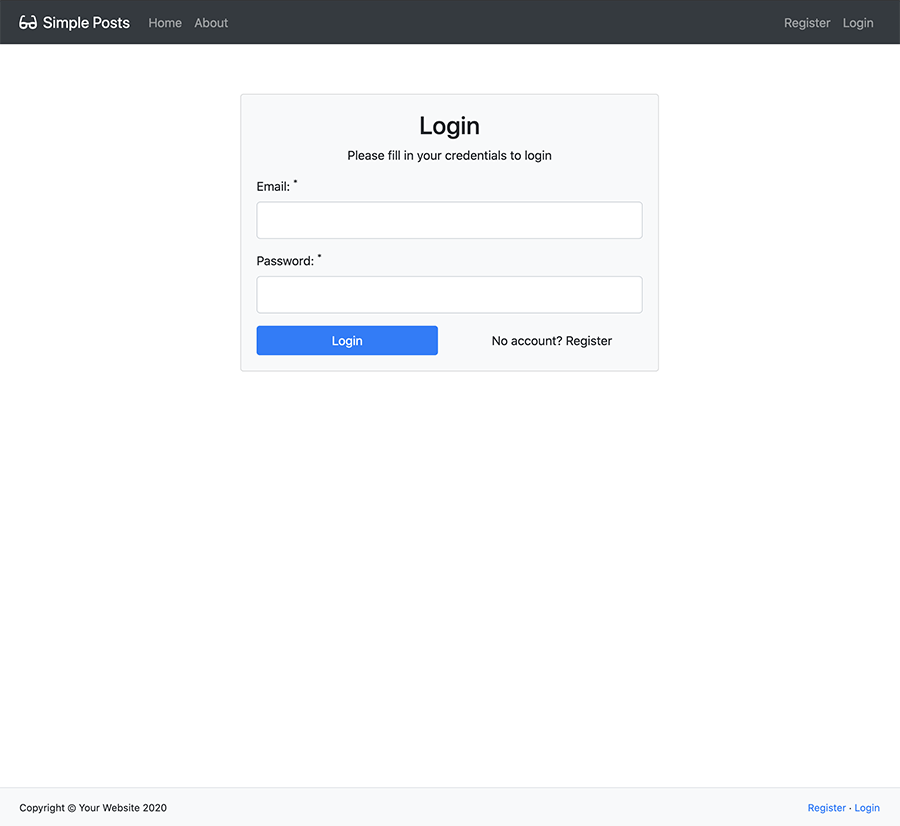

# PHP MVC Simple Posts App using Bootstrap 4

This is a simple posts app built with PHP (OOP) using a custom built MVC framework based on TraversyMVC.  There are a couple of changes that need to be make before you can use the app for yourself.

Upload the app/ and public/ folders that are in the src folder to your server.
Create a new database - I called mine 'simpleposts', and import the database.sql file.

Go to app/config/config.php and edit the following:
- Database username
- Database password
- Database name
- URLROOT
- Site Name

Go to the 'public' folder and edit the .htaccess file - add your root directory.

That should be enough to get you going.

#### Some information:
- Users can only edit or delete their own posts.
- Edit and delete buttons only show to the post owner.
- Passwords are encrypted and have minimum length set.
- The app is currently set that you need to login to see posts.
- PHP version is 7.03
- MySQL version is 5.6

### Demo images:
#### Login Page:

#### Register Page:

#### Posts Page:

#### Post Page:

